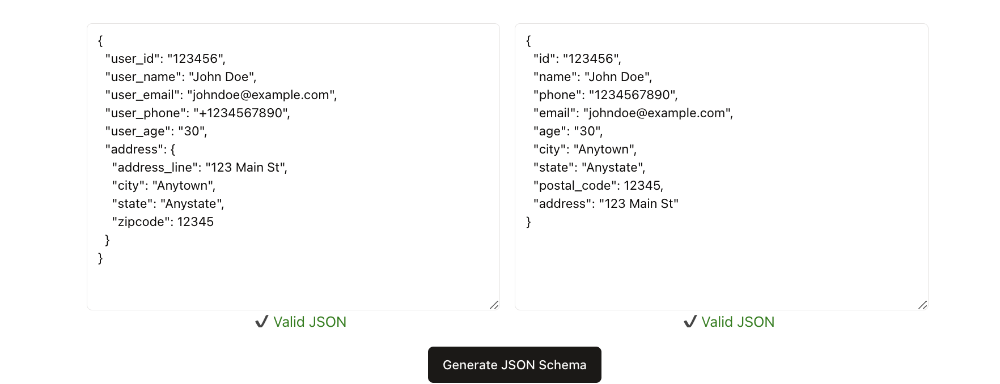
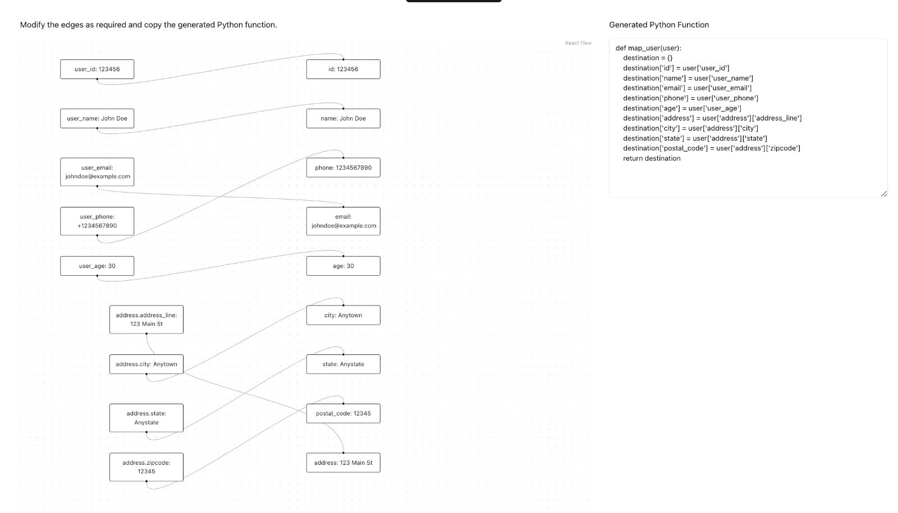

# Schema mapping demo

###### This is a simple demo to show how json schema can be used to validate and map json objects of same data with different structure between db and data warehouses.

### Installation and running
1. Clone the repository
2. Install the dependencies
``` npm install ```
3. Run the app
``` npm run dev ```
4. Open the browser and navigate to `http://localhost:3000`


### Features

1. Copy a a sample json object from source and destination and paste it in the respective textareas.
2. Click on the generate schema button to generate the schema for the source and destination json objects.
3. An interctive view will be displayed to show the schema of the source and destination json objects where users can map the keys from the source to the destination.
4. Using Open AI, the keys will be automatically mapped so users don't have to start from scratch.
5. Make any changes to the mapping and copy the mapping code in python that can be used to transform all the source json objects to destination json objects in your data pipeline.

### Screenshots
1. Object validation



2. Schema generation

